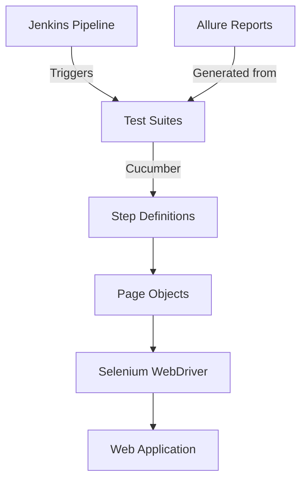
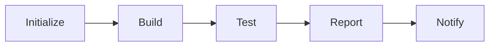

# 🌟 Advanced Test Automation Framework
<div align="center">

[](https://www.selenium.dev/)
[](https://www.java.com/)
[](https://cucumber.io/)
[](https://www.jenkins.io/)
[](https://maven.apache.org/)
[](https://junit.org/)


### 🎯 Enterprise-Grade Test Automation Solution
_Powered by Selenium WebDriver & Cucumber BDD_

[](https://github.com)
[](LICENSE)
[](https://github.com)

</div>

---

## 🎨 Features

<div align="center">

| 🚀 Feature | 📝 Description |
|------------|---------------|
| 🌐 Multi-Environment | QA, Staging, Production support |
| 🧪 Test Suites | Smoke & Regression testing |
| 📊 Rich Reporting | Allure reports with screenshots |
| 🔄 CI/CD Ready | Jenkins pipeline integration |
| 🛡️ Reliable | Stable and maintainable tests |
| 📱 Cross-Browser | Chrome, Firefox, Safari support |

</div>

## 🎯 Overview
This state-of-the-art test automation framework combines the power of Selenium WebDriver, Cucumber BDD, and Java to deliver a robust testing solution. With Jenkins CI/CD integration and comprehensive reporting via Allure, it provides enterprise-level quality assurance capabilities.

## ⚡ Quick Start

<details>
<summary>🔧 Prerequisites</summary>

- ☕ JDK 17
- 📦 Maven
- 🔄 Jenkins
- 🌿 Git

</details>

### 🚀 Installation

```bash
# Clone the repository
git clone <repository-url>

# Navigate to project directory
cd CursorAndJenkinsFile

# Install dependencies
mvn clean install
```

## 🏗️ Architecture



## 🛠️ Tech Stack

<div align="center">

| 🔧 Technology | 💫 Purpose |
|--------------|-----------|
|  | Core Language |
|  | Web Automation |
|  | BDD Framework |
|  | CI/CD Pipeline |
|  | Test Reporting |
|  | Build Tool |

</div>

## 📊 Project Structure

```ascii
📦 Test Framework
 ┣ 📂 src
 ┃ ┣ 📂 main/java
 ┃ ┃ ┣ 📂 pages        # Page Objects
 ┃ ┃ ┣ 📂 utils        # Utilities
 ┃ ┃ ┗ 📂 config       # Configurations
 ┃ ┗ 📂 test/java
 ┃   ┣ 📂 steps        # Step Definitions
 ┃   ┣ 📂 runners      # Test Runners
 ┃   ┗ 📂 hooks        # Test Hooks
 ┣ 📂 test-raporlari   # Test Reports
 ┣ 📜 Jenkinsfile      # Pipeline Config
 ┣ 📜 pom.xml          # Dependencies
 ┗ 📜 README.md        # Documentation
```

## 🔄 Jenkins Pipeline

<div align="center">

### 🎭 Pipeline Stages



</div>

### 🎮 Pipeline Parameters
| 🎯 Parameter | 🔍 Options | 📝 Description |
|-------------|-----------|---------------|
| `TEST_ENV` | QA/STAGING/PROD | Target environment |
| `TEST_SUITE` | Smoke/Regression | Test suite to execute |

## 📊 Reporting

<div align="center">

### 📈 Allure Report Features

| 📊 Feature | 🎯 Benefit |
|-----------|-----------|
| 📸 Screenshots | Visual failure analysis |
| ⏱️ Timeline | Test execution flow |
| 📉 Trends | Historical test results |
| 🔍 Details | Step-by-step execution |

</div>

## 🌟 Best Practices

### 📝 Coding Standards
- ✨ Follow Page Object Model
- 🧹 Clean code principles
- 📚 Comprehensive documentation
- 🧪 Test data separation
- 🔄 Regular maintenance

### 🤝 Contributing

1. 🌿 Fork the repository
2. 🔄 Create feature branch (`git checkout -b feature/AmazingFeature`)
3. ✨ Make changes
4. 📝 Commit (`git commit -m 'Add AmazingFeature'`)
5. 🚀 Push (`git push origin feature/AmazingFeature`)
6. 🎯 Open Pull Request

## 🎯 Support & Contact

<div align="center">

[](mailto:support@company.com)
[](https://github.com/issues)
[](https://github.com/wiki)

</div>

## 📜 License

<div align="center">

[](https://choosealicense.com/licenses/mit/)

Copyright 2024 - Present

**Made with ❤️ by Your Team**

</div>
